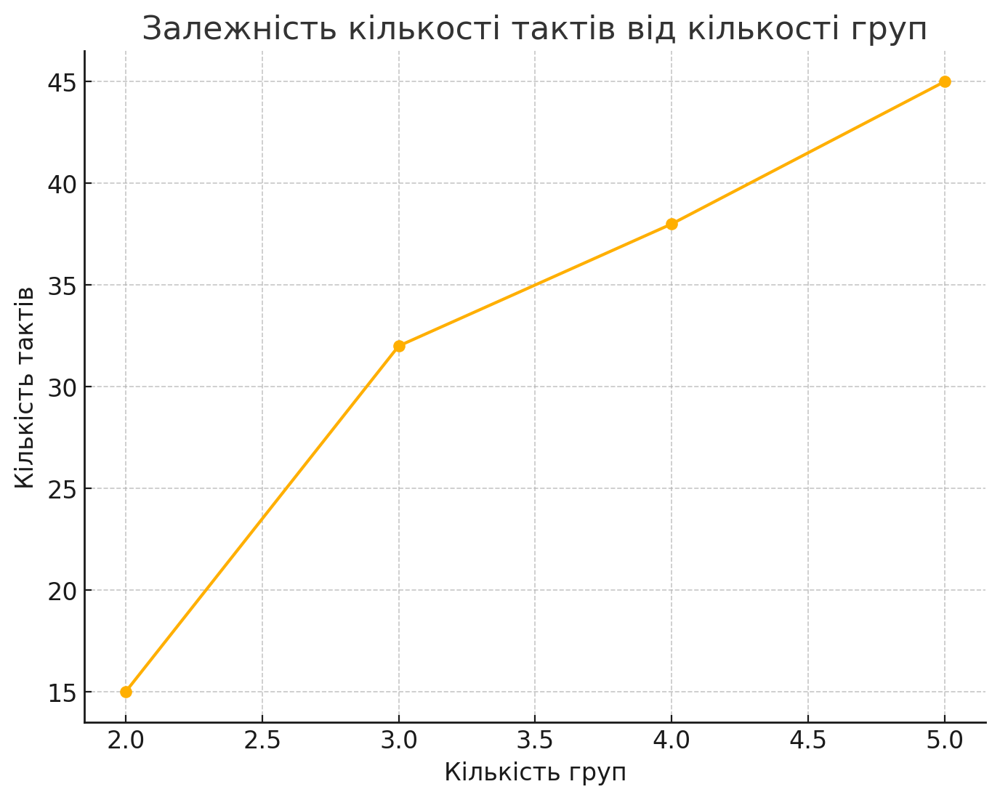
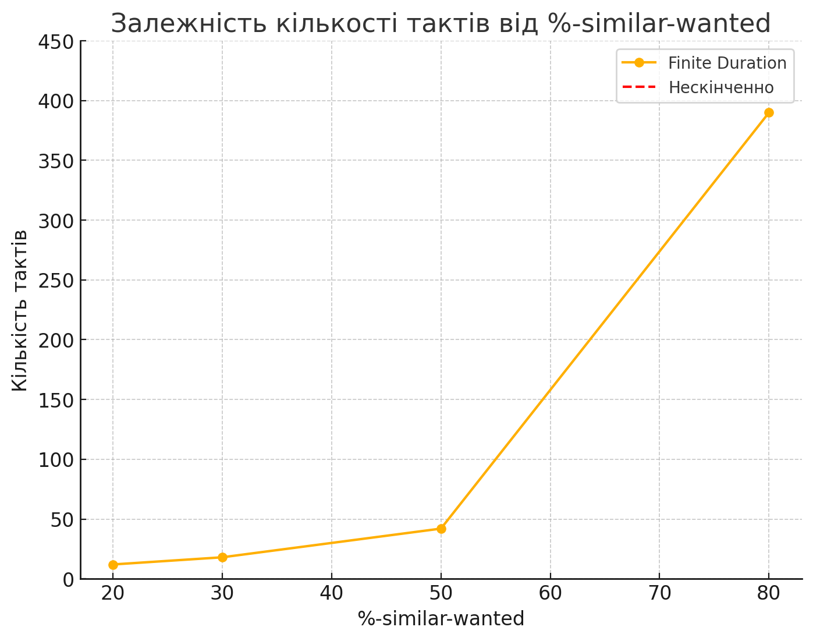
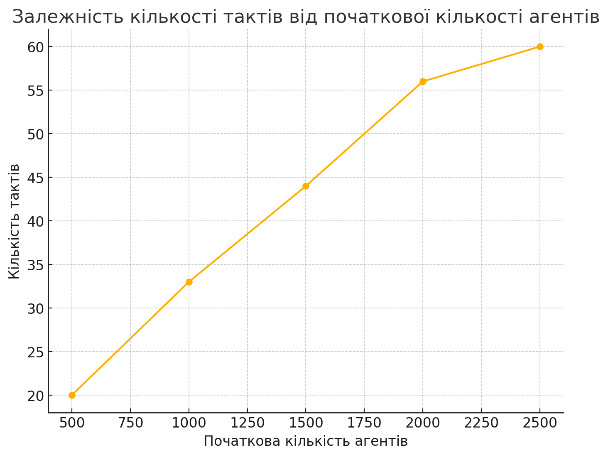

## Комп'ютерні системи імітаційного моделювання

## СПм-23-5, **Журавльов Олександр Юрійович**

### Лабораторна робота №**1**. Опис імітаційних моделей та проведення обчислювальних експериментів

 

### Варіант 8, модель у середовищі NetLogo:

[Segregation Simple Extension 1](http://www.netlogoweb.org/launch#http://www.netlogoweb.org/assets/modelslib/IABM%20Textbook/chapter%203/Segregation%20Extensions/Segregation%20Simple%20Extension%201.nlogo)

 

### Вербальний опис моделі:

Цей проект моделює поведінку агентів із різних соціальних груп у віртуальному середовищі. Усі агенти спочатку толерантні один до одного, але прагнуть розташуватись ближче до представників своєї групи. Модель ілюструє, як індивідуальні переваги агентів впливають на їхню динаміку розташування, формуючи групові кластери.

### Керуючі параметри:

- **number** визначає загальну кількість агентів.
- **number-of-groups** контролює кількість типів агентів.
- **%-similar-wanted** задає відсоток одноколірних сусідів, які бажані кожним агентом.

### Показники моделі:

**percent similar** - середній відсоток сусідів одного кольору. На початку цей показник дорівнює приблизно 0,4 через випадкове розташування агентів.  
**percent unhappy** - відсоток агентів, які не мають достатньої кількості одноколірних сусідів для задоволення.

### Примітки:

- Кількість незадоволених агентів зменшується з часом, але групи стають більш відокремленими, утворюючи кластери.
- Середня тривалість моделювання складає приблизно 35 тактів.

### Недоліки моделі:

- Відсутність поведінкових змін агентів залежно від зовнішніх умов.
- Немає можливості для агресивної взаємодії між групами.

 

## Обчислювальні дослідження

### 1. Вплив кількості соціальних груп на динаміку розташування агентів.

Аналізується, як параметр **number-of-groups** впливає на швидкість завершення моделювання.  
Експерименти проводяться при таких умовах:

- **number** 2500
- **%-similar-wanted** 40%

| Кількість груп | Кількість тактів |
| -------------- | ---------------- |
| 2              | 15               |
| 3              | 32               |
| 4              | 38               |
| 5              | 45               |

Графік демонструє, що збільшення кількості груп агентів веде до зростання часу, необхідного для досягнення стабільного стану.

### 2. Як збільшення бажаного відсотка одноколірних сусідів впливає на тривалість симуляції.

Досліджується залежність часу завершення моделювання від параметра **%-similar-wanted**.  
Експерименти проводяться при таких умовах:

- **number-of-groups** 3
- **number** 2500

| %-similar-wanted | Кількість тактів |
| ---------------- | ---------------- |
| 20               | 12               |
| 30               | 18               |
| 50               | 42               |
| 80               | 390              |
| 100              | Нескінченно      |

Графік показує, що при зростанні бажаного відсотка одноколірних сусідів тривалість моделювання значно збільшується.

### 3. Вплив загальної кількості агентів на стабільність системи.

Досліджується, як початкова кількість агентів **number** впливає на кількість тактів до завершення.  
Експерименти проводяться при таких умовах:

- **number-of-groups** 3
- **%-similar-wanted** 50%

| Початкова кількість агентів | Кількість тактів |
| --------------------------- | ---------------- |
| 500                         | 20               |
| 1000                        | 33               |
| 1500                        | 44               |
| 2000                        | 56               |
| 2500                        | 60               |

Графік підтверджує, що зі збільшенням кількості агентів також зростає час для досягнення стабільності.

