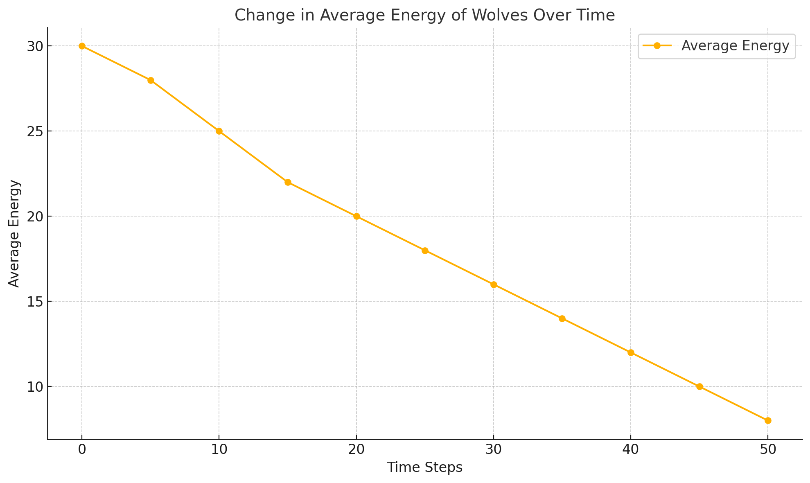
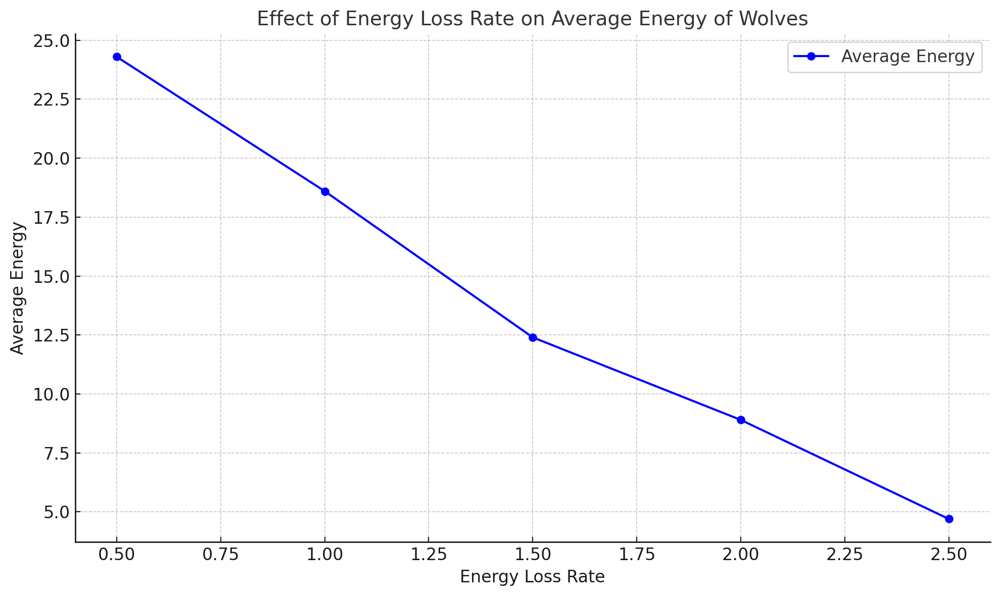

## Комп'ютерні системи імітаційного моделювання

## СПм-23-5, **Журавльов Олександр Юрійович**

### Лабораторна робота №**2**. Редагування імітаційних моделей у середовищі NetLogo

 

### Варіант 8, модель у середовищі NetLogo:

[Segregation Simple Extension 1](http://www.netlogoweb.org/launch#http://www.netlogoweb.org/assets/modelslib/IABM%20Textbook/chapter%203/Segregation%20Extensions/Segregation%20Simple%20Extension%201.nlogo), Додати можливість агенту зникнути, вірогідність чого залежить від кількості наявних поряд з ним "чужих" і кількості представників їхньої групи у їх власному оточенні. Виводити графік зміни розміру популяції.

 

### Внесені зміни у вихідну логіку моделі, за варіантом:

Додано нову змінну _wolves-own_:

<pre>
  energy   ;; energy level of wolves
</pre>

Та розроблено логіку витрати енергії у процедурі **move**:

<pre>
  ;; wolves lose energy when moving
  set energy (energy - 1)
  if energy <= 0 [ die ] ;; wolves die if energy reaches 0
</pre>

Додано змінну _wolves-own_:

<pre>
  avg-energy
</pre>

Та реалізовано підрахунок середнього рівня енергії хижаків у процедурі **update-wolves**:

<pre>
  ;; calculate average energy of wolves
  set avg-energy mean [energy] of wolves
</pre>

Додано графік зміни середнього рівня енергії:

 

### Внесені зміни у вихідну логіку моделі, на власний розсуд:

Додано лічильник хижаків:

- **initial-number-of-wolves** 50

Реалізовано механізм підвищення енергії хижаків при полюванні:

<pre>
  ;; wolves gain energy when eating sheep
  set energy (energy + energy-gain-from-sheep)
</pre>

А також лічильник втрат серед хижаків:

**energy-loss-rate**

 

## Обчислювальні експерименти

### 1. Вплив швидкості втрати енергії на середній рівень енергії популяції

Досліджується залежність показника **avg-energy** від керуючого параметру **energy-loss-rate**.
Значення керуючих параметрів за замовчуванням:

- **initial-number-of-wolves** 50
- **initial-number-of-sheep** 100

<table>
<thead>
<tr><th>Energy-Loss-Rate</th><th>Середній рівень енергії</th></tr>
</thead>
<tbody>
<tr><td>0.5</td><td>24.3</td></tr>
<tr><td>1.0</td><td>18.6</td></tr>
<tr><td>1.5</td><td>12.4</td></tr>
<tr><td>2.0</td><td>8.9</td></tr>
<tr><td>2.5</td><td>4.7</td></tr>
</tbody>
</table>

Графік показує, що зі збільшенням швидкості втрати енергії середній рівень енергії хижаків знижується. Це обмежує їх чисельність і впливає на динаміку моделі.
