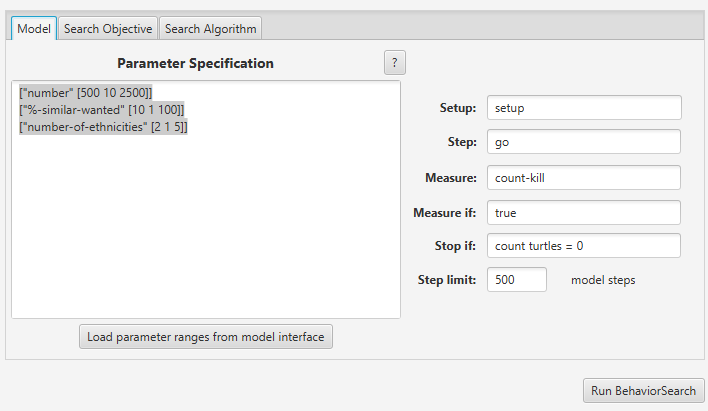
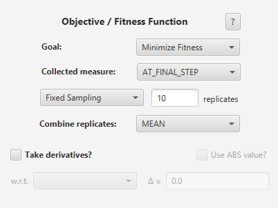
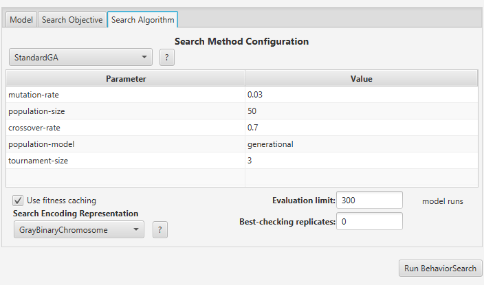
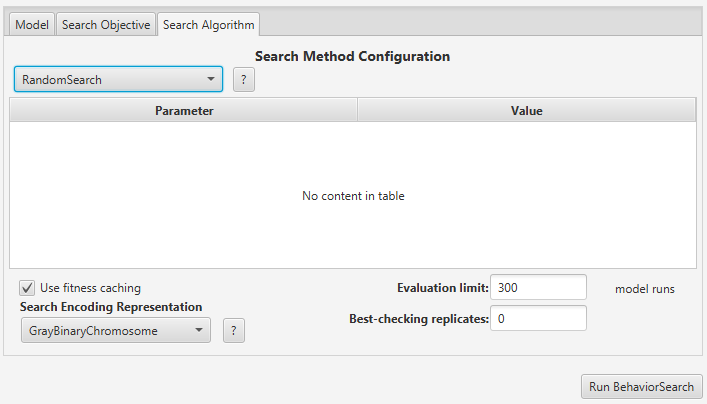
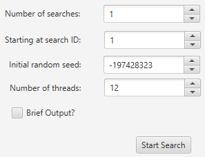
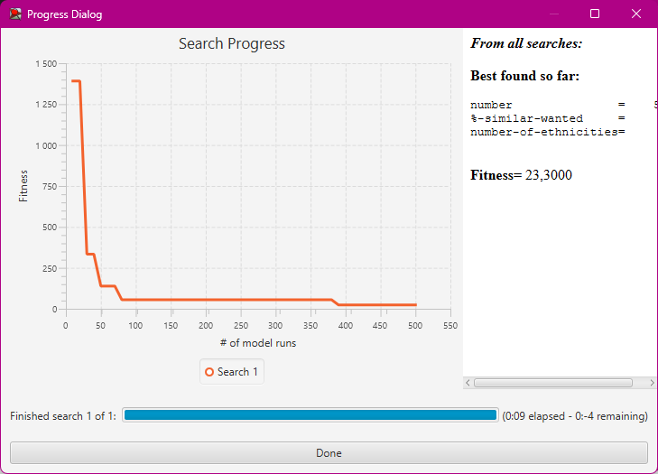

## Комп'ютерні системи імітаційного моделювання
## СПм-23-5, **Журавльов Олександр Юрійович**
### Лабораторна робота №**3**. Використання засобів обчислювального интелекту для оптимізації імітаційних моделей

 

### Варіант 8, модель у середовищі NetLogo:
[Segregation Simple Extension 1](http://www.netlogoweb.org/launch#http://www.netlogoweb.org/assets/modelslib/IABM%20Textbook/chapter%203/Segregation%20Extensions/Segregation%20Simple%20Extension%201.nlogo)

 

### Вербальний опис моделі:
Даний проект моделює взаємодію черепах (не в прямому сенсі) з різних етнічних груп у вигаданому водоймищі. Усі черепахи підтримують дружні стосунки один з одним, проте кожна з них прагне мешкати поблизу представників своєї "рідної" групи. В рамках цієї симуляції досліджується, як індивідуальні переваги черепах впливають на їх розподіл у водоймі, що призводить до формування великомасштабних моделей.

### Керуючі параметри:
- **number** керує загальною кількістю черепах.
- **number-of-ethnicities** контролює кількість різних типів черепах.
- **%-similar-wanted** контролює відсоток своїх, що хоче бачити черепах біля себе.

### Показники роботи системи:
**percent similar** - показує середній відсоток сусідів одного кольору для кожної черепахи. Він починається приблизно з 0,5, оскільки кожна черепаха починає (в середньому) з рівною кількістю червоних і зелених черепах як сусідів.
**percent unhappy** - показує відсоток черепах, які мають менше сусідів з однієї етнічної приналежності, ніж вони хочуть.

 

### Налаштування середовища BehaviorSearch:

**Обрана модель**:
<pre>
D:\labs\Журавльов\Segregation Simple Extension 1.nlogo
</pre>
**Параметри моделі** (вкладка Model):  
*Параметри та їх можливі діапазони були **автоматично** вилучені середовищем BehaviorSearch із вибраної імітаційної моделі, для цього є кнопка «Завантажити діапазони параметрів із інтерфейсу моделі»*, хоча й дещо підправлені для доцільності дослідження:
<pre>
["number" [500 10 2500]]
["%-similar-wanted" [10 1 100]]
["number-of-ethnicities" [2 1 5]]
</pre>
Використовувана **міра**:  
Для фітнес-функції *(вона ж функція пристосованості або цільова функція)* було обрано **значення кількості вбивств**, вираз для її розрахунку вказано у параметрі "**Measure**":
<pre>
count-kill
</pre>
Кількість вбивств повинна враховуватися **в кінці** симуляції, починаючи з 0 такту симуляції.  
*Параметр "**Mesure if**" зі значення true, по суті, і означає, що враховуватимуться всі такти симуляції, а чи не частина їх. Іноді має сенс не враховувати деякі такти через хаос в деяких моделях на початку їх використання. Наприклад, це показано в прикладі з документації BehaviorSearch.  
Параметри "**Setup**" та "**Go**" вказують відповідні процедури ініціалізації та запуску в логіці моделі (зазвичай вони так і називаються). BehaviorSearch в процесі роботи, по суті, замість користувача запускає ці процедури.*  
Параметр зупинки за умовою ("**Stop if**") у разі не використовувався.  
Загальний вигляд вкладки налаштувань параметрів моделі:  

**Налаштування цільової функції** (вкладка Search Objective):  
Метою підбору параметрів імітаційної моделі, є **мінімізація** значення – це вказано через параметр "**Goal**" зі значенням **Minimize Fitness**. У параметрі "**Collected measure**", що визначає спосіб обліку значень обраного показника, вказано **AT_FINAL_STEP**.
Щоб уникнути викривлення результатів через випадкові значення, що використовуються в логіці самої імітаційної моделі, **кожна симуляція повторюється по 10 разів**, результуюче значення розраховується як **середнє арифметичне**.
Загальний вигляд вкладки налаштувань цільової функції:  

**Налаштування алгоритму пошуку** (вкладка Search Algorithm):  
Загальний вид вкладки налаштувань алгоритму пошуку:  
Для генетичного алгоритму:  

Для випадкового пошуку:  

 

### Результати використання BehaviorSearch:
Діалогове вікно запуску пошуку:  

Результат пошуку параметрів імітаційної моделі, використовуючи **генетичний алгоритм**:  

Результат пошуку параметрів імітаційної моделі, використовуючи **випадковий пошук**:  

